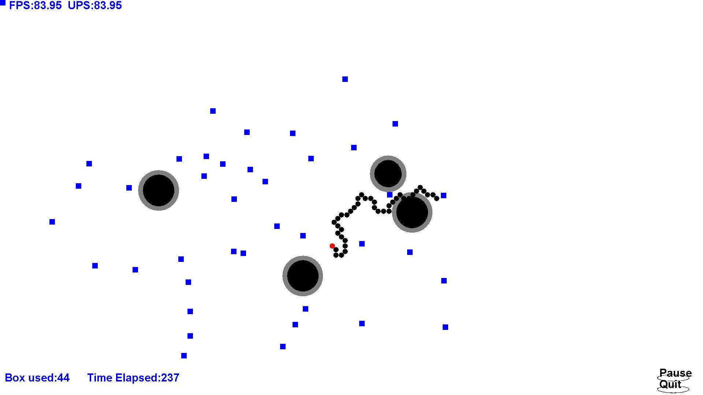
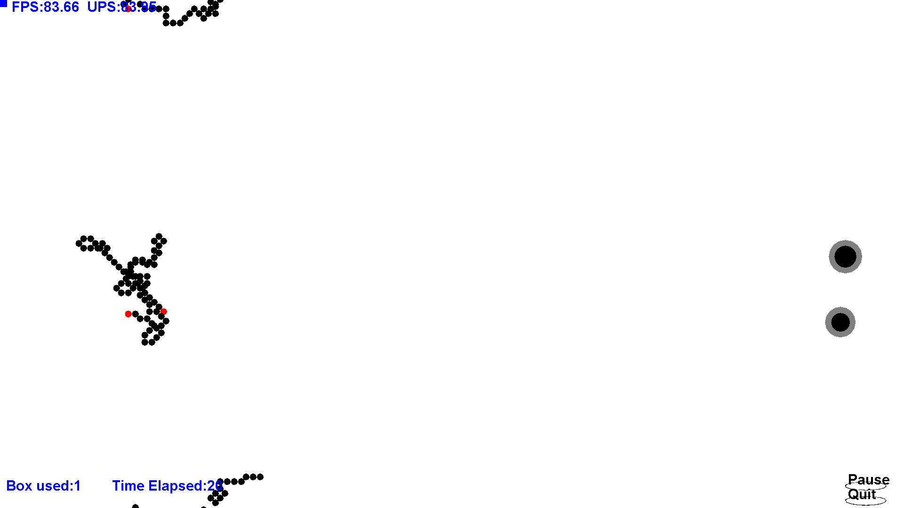
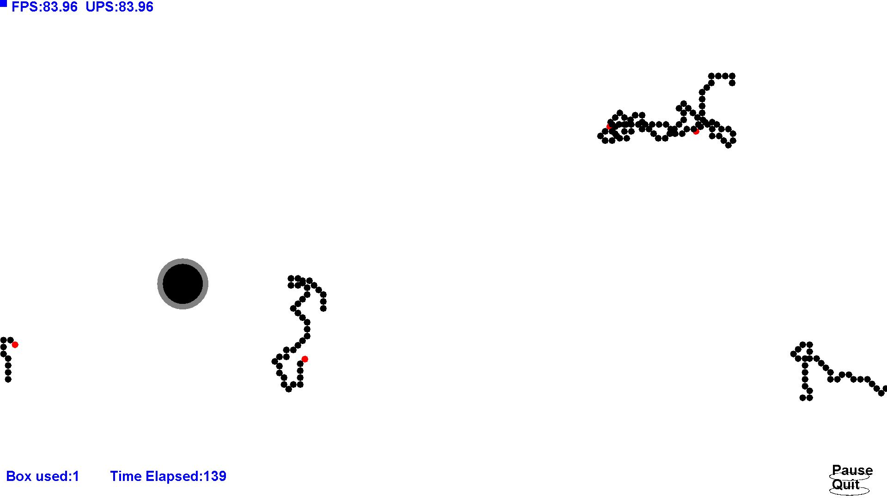

# Catch Fred

## Introduction
In this game, player will catch a worm called Fred. Player will build the fence with tiny blue box
and trap Fred into the fence. However, Fred moves so fast that it could escape from an incomplete 
box swiftly. At some point, Fred will dig a hole and hide itself in the hole. Moreover, Fred has made
a contract with devil. Fred can summon other three virtual Freds to create an illusion for player.

## Demo

Only one Fred is moving in the screen. As the number of blue boxes in the map grow, it will eventually
trap Fred. Also, Fred just leaves its hole but all other three mirrors have already 
snuck into the hole. 

The screen shot is a bit incomplete. But there are four Freds present.

A hole digged by Fred.

## Issues

A few improvements should be made to make the game complete. 

First, this game lacks a mechanism to detect the end of the game - when Fred
cannot move around by some distance, then the game is over and player wins. 

Besides, the game stats could be exported such that multiple players
can compare who uses the least box to catch Fred the evil worm.

